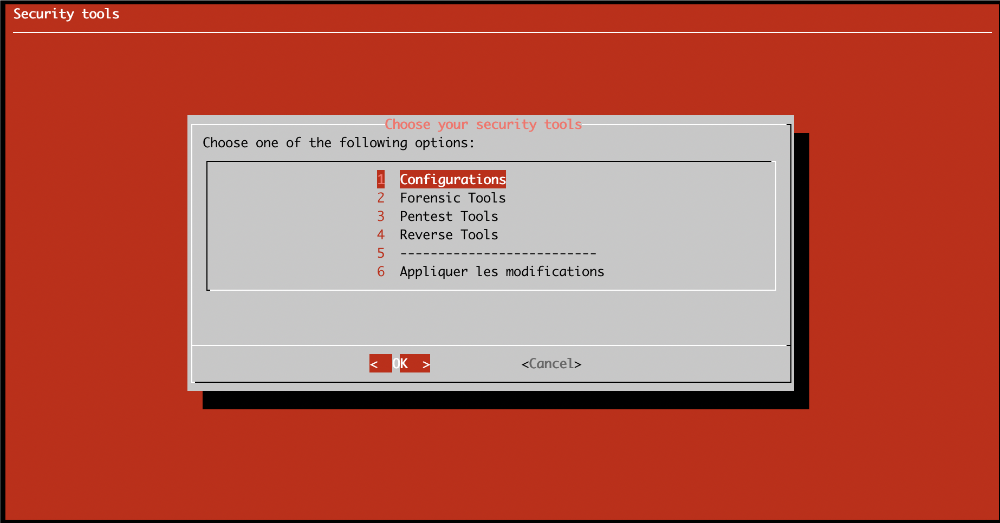
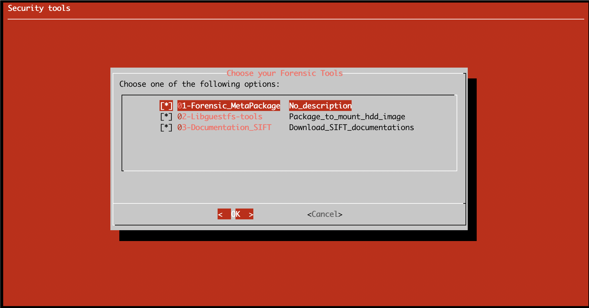

# kali--postinstall

This is a script that will complete a new installation of the "kali" distribution.
This script has been tested, and works on Kali XFCE version.

## How to use it

```
git clone https://github.com/kidrek/kali--postinstall.git
./postinstall.sh
```




## Modules

### How to add modules

Add file, with cnf as extension, in specific directory. It's necessary to have this 3 variables.

```
NAME=""
DESC=""
COMMAND=""
```

### How to test modules

To test your module, it's not necessary to execute the main script.
You have to use ```source``` command, then try to display each variables.

```
# source <MYNEWMODULE>.cnf
# echo $NAME
# echo $DESC
# echo $COMMAND
```

To execute new modules's command and check result, run : 

```
# source <MYNEWMODULE>.cnf
# eval $COMMAND
```
